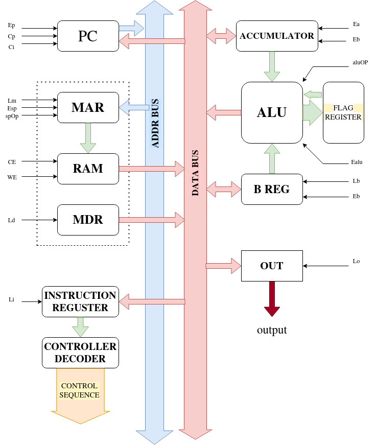

# Supplied Instruction Set

| NO | HEX CODE | INSTRUCTION       |
|----|:--------:|-------------------|
| 0  | 0        | ADD  A,B          |
| 1  | 1        | SUB  A,B          |
| 2  | 2        | XCHG  B,A         |
| 3  | 3        | RCL  A            |
| 4  | 4        | OUT  A            |
| 5  | 5        | INC  A            |
| 6  | 6        | MOV   B,[ADDRESS] |
| 7  | 7        | MOV  B,BYTE       |
| 8  | 8        | JMP  ADDRESS      |
| 9  | 9        | PUSH  B           |
| 10 | A        | POP  B            |
| 11 | B        | NOT  A            |
| 12 | C        | CALL  ADDRESS     |
| 13 | D        | RET               |
| 14 | E        | TEST  A,B         |
| 15 | F        | HLT               |

# Design



# Modules

## Program Counter

The program counter is implemented as a register that stores the address of the
instruction to be executed. 

* It passes the address to the Memory Address Register through the DATA BUS if Ep is enabled. 
* If Cp is enabled, the counter increments, pointing the address of the next instruction to be executed. 
* If Ci is enabled, the counter receives the address of the instruction to jump to from
the data bus coming from the RAM.


## Memory

The memory module combines the following 4 parts

1. Memory Address Register (MAR)
2. RAM
3. Memory Data Register (MDR)
4. Stack Pointer (SP)

The RAM is of size 15x256. It can store 8 bit data.It stores the instructions 
to be executed and the data from a file named "program.hex".

1. The MAR has the control input Lm. If Lm(Laddr) is enabled, MAR inputs the address of
  the instruction stored on RAM to be executed from the Program Counter through
  the DATA BUS. The address is then passed on to the RAM to read the
  instruction and the data at that address.

2. The RAM, getting the address from MAR, reads the data stored. Of each 8 bit
  at each address of the RAM, the upper 4 bits store the instruction to be
  executed and the lower 4 bits contains the data. The lower 4 bits are
  trasnferred to the MDR.
  * If CE(Eram) is enabled, the RAM outputs the first 4 bits containing the OPCODE of
    the instruction to be executed to the IREG through the DATA BUS.
  * If WE is enabled, the data coming into the RAM from the BUS is written to
    the address supplied by the MAR.

3. The MDR receives the lower 4 bits of the datas stored in the RAM
  * If Ed is enabled, the lower 4 bits trasnferred from the RAM to the MDR are
    passed onto the BUS.

4. The SP is a register that stores the address of the current position in stack
  which starts from the top address(15) of the RAM.
  * If Esp is enabled the SP transfers the SP address to the MAR for reading or
    writing to that address.
  * spOP is a control input which defines what operation to perform on the stack
    * 00 -> CLEAR (resets address to 15)
    * 01 -> HOLD (default)
    * 10 -> PUSH (decrements the SP)
    * 11 -> POP (increments the SP)


## Instruction Register

The instruction register stores the opcode of the next instruction to be
executed. It loads the instruction from the data bus coming from the RAM when
Li is enabled. The instruction is then passed onto the controller for decoding
and changing the control bits necessarily.

## Controller

The controller sends out control instructions. The control instruction is 20
bits wide. It receives the opcode to be executed from the instruction register
and decodes it into prestored(ROM) control instructions. The control bits are
connected to the control inputs of the rest modules in the following order.

> Cp Ep Ci Lm WE CE Ed Li La Ea   Op     Ealu Lb Eb Esp spOp Lo

The controller also counts the instruction cycles. Maximum 8 cycles are
required for the designed CPU. The controller has a cycle counter. 

The first 2 cycles T1 and T2 are fetch cycles and the rest are execution
cycles. On completeion of a command, the cycle is rest to 0 and next instructin
is fetched through the fetch cycle. and thus the cycle continues.

## Accumulator

The accumulator is a register. It acts as a temporary fast storage that
directly outputs the stored data to ALU independent of the CLK.

* If the control input Ea is enabled, the accumulator puts its stored content
  onto the DATA BUS.
* If La is enabled, the accumulator loads data from the DATA BUS.

## ALU

This is the Arithmetic Logic Unit. It takes inputs directly from the
accumulator and the B register. and operates on these 2. ALU has a 2 bit opcode
that defines what operation to perform on the inputs. The opcode "aluOP" comes
from the controller. The opcodes and respective functions are:

  | opcode |  Operation    
  |--------|--------------
  |  000   |   None
  |  001   |   Addition
  |  010   |   Subtraction
  |  011   |   Increment
  |  100   |   Not 
  |  101   |   RCL
  |  110   |   Test
  |  111   |   None

The Alu outputs 3 flags to the FLAG REGISTER. 
    1. carry flag CFLAG
    2. zero flag ZFGLAG
    3. sign flag SFLAG (Still to be implemented)

## Flag register

The flag register stores the values of the 3 flags output by the ALU and feeds
them back to the ALU for necessary operations.


## B register

It is a second register to the accumulator used for temporary storage of data.
It feeds teh data directly to the ALU for operation.

* If Eb is enabled, the register puts its contents on the DATA BUS
* If Lb is enabled, it loads data into it from the DATA BUS.


## Output

This module simply outputs the result of the operation of the cpu which is
stored in the accumulator.

* If Eo is enabled, the module reads data from the BUS which comes from the accumulator
  and outputs it.


# Verilog Implementation

All the above mentioned parts are implemented as seperate modules in the
verilog code with all the necessary input output ports, the 4 bit DATA BUS, the 4 bit ADDR
BUS, and the 20 bit CONTROL BUS.

These modules are tied together by the top level module ```cpu```. The CPU
takes the CLK as input, reads the machine code stored in the file "program.hex"
and outputs the result.

# Assembler written in Python

In order to compile the assembly code into a hex file for reading by the CPU,
a very simple assembler has been written using Python. The assembler takes an
assembly file "{FileName}.asm" as command line input and outputs the hex file
by the name "{FileName}.hex". The following command is to be issued to assemble
the file. The file should be named "program.asm" as the ```cpu``` module looks
for the file ```program.hex``` to read the instructions from

```bash
./asm.py program.asm
```

or

```bash
python3 asm.py program.asm
```

# Running the CPU

In order to run the cpu, a "Makefile" has been written. The open source
software "Icarus Iverilog" has been used to run the CPU. With the current
working directory as the the directory the ```4bit_CPU.v``` is in, run the
following to build the cpu.

```bash
make clean && make build
```

Now run the CPU as follows

```bash
vvp computer 
```

Or the build and run can be done in a single step as

```bash
build run
```

# Sample Program

The following program was written in assembly

```asm
MOV B,3
ADD A,B   ; add A and B
MOV B,6
ADD A,B
PUSH B
MOV B,2
POP B
CALL a  ; call subtraction
OUT A
HLT
subtraction:  SUB A,B
    		  RET
```

This is suppossed to output the value 3.

We assemble the program using

```bash
./asm.py program.asm
```

The following hex file was created

```
73
00
76
00
90
72
a0
ca
40
f0
10
d0
```

Now we build and run the CPU

```bash
make run
```

## Output:

```bash
iverilog -o computer \
                        testbenches/cpu_tb.v
vvp -n computer
WARNING: ./4bit_CPU.v:82: $readmemh(program.hex): Not enough words in the file for the requested range [0:15].
VCD info: dumpfile machine.vcd opened for output.
time =  0, out =  z
time = 99, out =  3
```

So, we get the correct output

The vector waveform file was also generated which we can view with the
following command

```bash
make run view
```


Here we see the change in values of A and B registers and the final output 3.


## Control states for different operations

| operation  |Cp|Ep|Ci|Lm|WE|CE|Ed|Li|La|Ea|  Op    |Ealu|Lb|Eb|Esp|spOp|Lo
| -----------|--|--|--|--|--|--|--|--|--|--|--------|----|--|--|---|----|--
| T_1        |0 |1 |0 |1 |0 |0 |0 |0 |0 |0 |0  0  0 |0   |0 |0 |0  |0  1| 0
| T_2        |1 |0 |0 |0 |0 |1 |0 |1 |0 |0 |0  0  0 |0   |0 |0 |0  |0  1| 0
| ADD_A_B    |0 |0 |0 |0 |0 |0 |0 |0 |0 |0 |0  0  1 |0   |0 |0 |0  |0  1| 0
|            |0 |0 |0 |0 |0 |0 |0 |0 |1 |0 |0  0  0 |1   |0 |0 |0  |0  1| 0
| SUB_A_B    |0 |0 |0 |0 |0 |0 |0 |0 |0 |0 |0  1  0 |0   |0 |0 |0  |0  1| 0
|            |0 |0 |0 |0 |0 |0 |0 |0 |1 |0 |0  0  0 |1   |0 |0 |0  |0  1| 0
| XCHG_B_A   |0 |0 |0 |0 |0 |0 |0 |0 |0 |0 |0  0  1 |0   |0 |0 |0  |0  1| 0
|            |0 |0 |0 |0 |0 |0 |0 |0 |1 |0 |0  0  0 |1   |0 |0 |0  |0  1| 0
|            |0 |0 |0 |0 |0 |0 |0 |0 |0 |0 |0  1  0 |0   |0 |0 |0  |0  1| 0
|            |0 |0 |0 |0 |0 |0 |0 |0 |0 |0 |0  0  0 |1   |1 |0 |0  |0  1| 0
|            |0 |0 |0 |0 |0 |0 |0 |0 |0 |0 |0  1  0 |0   |0 |0 |0  |0  1| 0
|            |0 |0 |0 |0 |0 |0 |0 |0 |1 |0 |0  0  0 |1   |0 |0 |0  |0  1| 0
| RCL_A      |0 |0 |0 |0 |0 |0 |0 |0 |0 |0 |1  0  1 |0   |0 |0 |0  |0  1| 0
|            |0 |0 |0 |0 |0 |0 |0 |0 |1 |0 |0  0  0 |1   |0 |0 |0  |0  1| 0
| OUT_A      |0 |0 |0 |0 |0 |0 |0 |0 |0 |1 |0  0  0 |0   |0 |0 |0  |0  1| 1
| INC_A      |0 |0 |0 |0 |0 |0 |0 |0 |0 |0 |0  1  1 |0   |0 |0 |0  |0  1| 0
|            |0 |0 |0 |0 |0 |0 |0 |0 |1 |0 |0  0  0 |1   |0 |0 |0  |0  1| 0
| MOV_B_ADDR |0 |0 |0 |1 |0 |0 |1 |0 |0 |0 |0  0  0 |0   |0 |0 |0  |0  1| 0
|            |0 |0 |0 |0 |0 |0 |1 |0 |1 |0 |0  0  0 |0   |0 |0 |0  |0  1| 0
|            |0 |0 |0 |0 |0 |0 |0 |0 |0 |0 |0  0  0 |0   |0 |0 |0  |0  1| 0
| MOV_B_BYTE |0 |0 |0 |0 |0 |0 |1 |0 |0 |0 |0  0  0 |0   |1 |0 |0  |0  1| 0
|            |0 |0 |0 |0 |0 |0 |0 |0 |0 |0 |0  0  0 |0   |0 |0 |0  |0  1| 0
| JMP_ADDR   |0 |0 |1 |0 |0 |0 |1 |0 |0 |0 |0  0  0 |0   |0 |0 |0  |0  1| 0
| PUSH_B     |0 |0 |0 |0 |0 |0 |0 |0 |0 |0 |0  0  0 |0   |0 |0 |1  |0  1| 0
|            |0 |0 |0 |0 |1 |0 |0 |0 |0 |0 |0  0  0 |0   |0 |1 |0  |1  0| 0
| POP_B      |0 |0 |0 |1 |0 |0 |0 |0 |0 |0 |0  0  0 |0   |0 |0 |1  |1  1| 0
|            |0 |0 |0 |0 |0 |0 |1 |0 |0 |0 |0  0  0 |0   |1 |0 |0  |0  1| 0
| NOT_A      |0 |0 |0 |0 |0 |0 |0 |0 |0 |0 |1  0  0 |0   |0 |0 |0  |0  1| 0
|            |0 |0 |0 |0 |0 |0 |0 |0 |1 |0 |0  0  0 |1   |0 |0 |0  |0  1| 0
| CALL_ADDR  |0 |0 |0 |0 |0 |0 |0 |0 |0 |0 |0  0  0 |0   |0 |0 |1  |1  0| 0
|            |0 |0 |0 |0 |1 |0 |0 |0 |0 |0 |0  0  0 |0   |0 |0 |0  |0  1| 0
|            |0 |0 |0 |1 |1 |0 |0 |0 |0 |0 |0  0  0 |0   |0 |0 |0  |0  1| 0
|            |0 |0 |1 |0 |0 |0 |1 |0 |0 |0 |0  0  0 |0   |0 |0 |0  |0  1| 0
| RET        |0 |0 |0 |0 |0 |0 |0 |0 |0 |0 |0  0  0 |0   |0 |0 |1  |1  1| 0
| TEST_A_B   |0 |0 |0 |0 |0 |0 |0 |0 |0 |0 |1  1  0 |0   |0 |0 |0  |0  1| 0
|            |0 |0 |0 |0 |0 |0 |0 |0 |1 |0 |0  0  0 |1   |0 |0 |0  |0  1| 0
| HLT        |0 |0 |0 |0 |0 |0 |0 |0 |0 |0 |0  0  0 |0   |0 |0 |0  |0  0| 0


